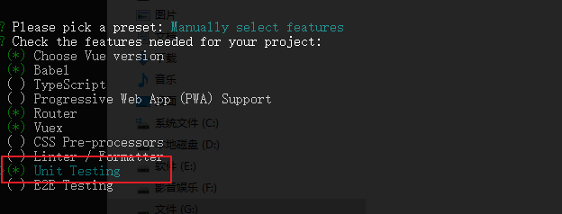
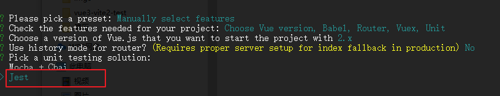
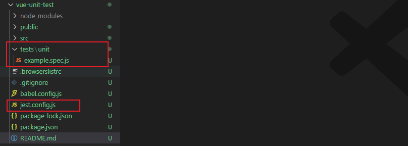

# `Vue` 单元测试

对 `Vue` 进行单元测试相关的一些随笔记录。主要是以 `Vue Test Utils` + `jest` 进行单元测试

`Vue Test Utils` 文档：https://vue-test-utils.vuejs.org/zh/


## 1、`Vue` 单元测试环境搭建


### 1-1、利用 vue-cli

如果是新建项目，那么可以利用 `vue-cli` 快速集成测试环境

首先在创建项目的时候，将单元测试选上：

 

然后选择 jest 作为测试运行器



生成的项目，会比常规的多出：

- tests 目录：这里面存放的就是单元测试用例
- `jest.config.js`：jest 相关的配置项




并且在 `package.json` 中，会多出一条命令：

```js
{
  "scripts": {
    "test:unit": "vue-cli-service test:unit"
  }
}
```

执行 `npm run test:unit` 实际上就是执行的 `tests/unit/example.spec.js` 这个测试用例：

```js
import { shallowMount } from '@vue/test-utils'
import HelloWorld from '@/components/HelloWorld.vue'

describe('HelloWorld.vue', () => {
  it('renders props.msg when passed', () => {
    const msg = 'new message'
    const wrapper = shallowMount(HelloWorld, {
      propsData: { msg }
    })
    expect(wrapper.text()).toMatch(msg)
  })
})
```


### 1-2、现有项目添加单元测试

现有项目，可以通过 `vue-cli` 添加插件的方式，执行命令：

```js
vue add unit-jest
```


### 1-3、常用的 jest.config.js 配置

```js
module.exports = {
  preset: '@vue/cli-plugin-unit-jest',
  snapshotSerializers: ['jest-serializer-vue'],
  moduleNameMapper: {
    '^@/(.*)$': '<rootDir>/src/$1'
  },
  testMatch: [
    '**/tests/unit/**/*.spec.(js|jsx|ts|tsx)|**/__tests__/*.(js|jsx|ts|tsx)'
  ],
  collectCoverage: true,
  coverageDirectory: '<rootDir>/tests/unit/coverage',
  collectCoverageFrom: [
    'src/components/**/*.vue',
    'src/utils/**/*.ts',
    'src/store/modules/*.ts',
    '!src/utils/axios.ts',
    '!src/utils/notify.ts'
  ]
}
```

- `snapshotSerializers`：`Vue`组件进行`Jest`快照序列化的工具配置
- `moduleNameMapper`：模块别名配置
- `testMatch`：测试文件查找规则，可以是统一放在`src/tests`目录下，也可以就近放在`__tests__`目录下
- `collectCoverage`：是否进行测试覆盖率收集
- `coverageDirectory`：测试报告存放位置
- `collectCoverageFrom`：测试哪些文件和不测试哪些文件


## 2、`Vue` 单元测试

接下来将使用 `Vue Test Utils` + `jest` 进行单元测试。

`Vue Test Utils` 是 `Vue.js` 官方的单元测试实用工具库，能够对我们编写的 `Vue` 组件进行测试，它包含一些辅助方法可以实现组件挂载、与组件交互以及断言组件输出等功能，让`Vue` 组件单元测试变得更加简单


### 2-1、测试组件渲染输出


#### 2-1-1、组件挂载测试

在 `vue` 中，通过`import`引入组件，然后在`components`进行注册后就能使用；在单元测试中，使用`Vue Test Utils ` 的 `mount`或者 `shallowMount` 来进行挂载组件，两者的区别：

- 对于不包含子组件的组件来说，两者是一样的
- 区别在于，`shallowMount`只渲染组件本身，不会渲染子组件，但会保留子组件在组件中的存根
- `mount` 会渲染整个组件树

`mount`和 `shallowMount` 挂载组件，并返回一个包装器 wrapper，这个包装器里面除了包含 `vm` 实例，还包含了很多用于测试组件的属性和方法

既然可以通过 `wrapper.vm` 拿到组件的 `vm` 实例，那么就意味着可以通过 `wrapper.vm` 访问到组件的 `props`、`data` 和 `methods` 等等


例子，有组件：

```js
<template>
  <div class="mount">
    <p>哈哈哈哈</p>
  </div>
</template>
<script>
export default {
  data() {
    return {}
  }
}
</script>
```

测试组件是否挂载：

```js
import { shallowMount } from '@vue/test-utils'
import ComMount from '../../src/components/ComMount.vue'

test('mount', () => {
  const wrapper = shallowMount(ComMount)
  // 测试组件是否被挂载
  expect(wrapper.exists()).toBe(true)
})
```


#### 2-1-2、组件文本测试

有组件：

```js
<template>
  <div class="mount">
    <p>{{ msg }}</p>
  </div>
</template>
<script>
export default {
  data() {
    return {
      msg: 'hello, test'
    }
  }
}
</script>
```

测试用例：

```js
import { shallowMount } from '@vue/test-utils'
import ComMount from '../../src/components/ComMount.vue'

test('text', () => {
  const msg = 'hello, test'
  const wrapper = shallowMount(ComMount)
  expect(wrapper.text()).toBe(msg) // 严格相等，只能有一个 msg 文本
  expect(wrapper.text()).toContain(msg) // 是否包含
})
```

当组件不止一个 `msg` 文本的时候，可以使用 `toContain` 判断包含关系

也可以通过 `wrapper.find` 找到对应的标签再判断【find 是一个 query 选择器】

```js
import { shallowMount } from '@vue/test-utils'
import ComMount from '../../src/components/ComMount.vue'

test('text', () => {
  test('text', () => {
    const wrapper = shallowMount(ComMount)
    const msg = 'hello, test'
    expect(wrapper.find('.msg').text()).toBe(msg)
  })
})
```


#### 2-1-3、HTML 结构和 DOM 属性测试

有组件：

```js
<template>
  <div class="mount">
    <span id="span-text">哈哈哈</span>
    <h4 id="p-text">你好</h4>
  </div>
</template>
<script>
export default {
  data() {
    return {
      msg: 'hello, test'
    }
  }
}
</script>
```

测试用例：

```js
test('html', () => {
  const html = '<span>哈哈哈</span>'
  const wrapper = shallowMount(ComMount)
  expect(wrapper.html()).toContain(html)
})
```


挂载组件后返回的包装器，有 `wrapper.attributes()` 可以进行 DOM 属性测试

```js
test('dom', () => {
  const wrapper = shallowMount(ComMount)

  const h4Ele =  wrapper.find('h4')
  expect(h4Ele.attributes().id).toBeTruthy() // 是否有 id 属性
  expect(h4Ele.attributes().id).toBe('p-text') // id 属性是否为 span-text

  // 另一种方式
  expect(h4Ele.attributes('id')).toBeTruthy() // 是否有 id 属性
  expect(h4Ele.attributes('id')).toBe('p-text') // id 属性是否为 span-text
})
```


#### 2-1-4、class 和 style 测试

有组件：

```js
<template>
  <div class="mount">
    <h4 class="p-ele" style="color: red;">你好</h4>
  </div>
</template>
<script>
export default {
  data() {
    return {
      msg: 'hello, test'
    }
  }
}
</script>
```

**测试 class：**与测试 DOM 属性基本一致，只是测试 class 使用的是 `classes`

```js
test('class', () => {
  const wrapper = shallowMount(ComMount)
  const h4Ele =  wrapper.find('h4')
  expect(h4Ele.classes()).toContain('p-ele')
})
```

**测试 style：**可以使用包装器的  `element.style` 访问该 `DOM` 节点的**内联样式**

```js
test('style', () => {
  const wrapper = shallowMount(ComMount)
  const style = wrapper.find('h4').element.style
  expect(style.color).toBe('red')
})
```


#### 2-1-5、props 测试

有组件：

```js
<template>
  <div class="mount">
    <p class="user-info">姓名：{{ name }} | 年龄：{{ age }}</p>
  </div>
</template>
<script>
export default {
  props: ['name', 'age'],
  data() {
    return {
      msg: 'hello, test'
    }
  }
}
</script>
```

测试用例：

```js
test('props', () => {
  const wrapper = shallowMount(ComMount, {
    propsData: {
      name: 'jack',
      age: 18
    }
  })

  expect(wrapper.props('name')).toBe('jack')
  expect(wrapper.props().age).toBe(18)
  expect(wrapper.find('.user-info').text()).toContain('jack')
})
```


 ### 2-2、测试组件方法


#### 2-2-1、测试方法

上面说过，可以通过 `wrapper.vm` 访问到组件实例上的 data、methods 等

有组件：

```js
<template>
  <div v-show="show">
    <p>显示与隐藏</p>
  </div>
</template>
<script>
export default {
  data() {
    return {
      show: false
    }
  },
  methods: {
    showHandle() {
      this.show = true
    },
    hideHandle() {
      this.show = false
    }
  }
}
</script>
```

测试用例：

```js
import { shallowMount } from '@vue/test-utils'
import ComMethod from '../../src/components/ComMethod.vue'

describe('测试组件方法', () => {
  let wrapper
  // jest 的钩子函数，在执行每一个测试用例之前调用
  beforeEach(() => {
    wrapper = shallowMount(ComMethod)
  })

  test('showHandle', async () => {
    expect(wrapper.vm.show).toBe(false) // 一开始是 false
    expect(wrapper.isVisible()).toBe(false) // 一开始，是隐藏状态

    wrapper.vm.showHandle()
    await wrapper.vm.$nextTick()

    expect(wrapper.vm.show).toBe(true)
    expect(wrapper.isVisible()).toBe(true)
  })

  test('hideHandle', async () => {
    // 先将 data 中的 show 设置为 true，这个方法是异步的，需要配合 $nextTick
    wrapper.setData({
      show: true
    })

    await wrapper.vm.$nextTick()
    expect(wrapper.vm.show).toBe(true)
    expect(wrapper.isVisible()).toBe(true)

    wrapper.vm.hideHandle()
    await wrapper.vm.$nextTick()
    expect(wrapper.vm.show).toBe(false)
    expect(wrapper.isVisible()).toBe(false)
  })
})
```

- `beforeEach`： jest 的全局钩子，代表在执行每一个测试函数之前执行；这里在这个钩子函数中重新挂载组件，避免多个测试用例互相影响
- 由于方法修改了数据，进而会触发`DOM`更新，所以需要调用组件的`$nextTick()`方法，确保获取到了正确`DOM`的状态
- `isVisible`：判断一个`DOM`元素是否可见；也可以使用`exists()`和`v-if`指令来代替
- `setData`：手动修改组件中`data`的值，需要注意的是它是异步的，需要配合`$nextTick()`一起使用


#### 2-2-2、测试定时器

如果不对定时器函数做处理，当一个组件有一个延时`1000ms`的`setTimeout`时，则意味着我们测试程序必须等待`1000ms`，如果系统中存在很多个`setTimeout`函数，那么对于以速度、高效率的单元测试来说无疑是一场灾难。

此时，就可以使用`Jest.useFakeTimers`替换全局定时器函数，替换后可以使用`runTimersToTime`推进时间。


有组件：

```js
<template>
  <div>
    <p>{{ text }}</p>
  </div>
</template>

<script>
export default {
  data() {
    return {
      text: '',
      count: 0,
      timer: null
    }
  },
  methods: {
    startSetTimeout() {
      setTimeout(() => {
        this.text = 'test setTimeout'
      }, 5000)
    },
    start() {
      this.timer = setInterval(() => {
        this.count++
        if(this.count > 10) {
          this.stop()
        }
      }, 1000)
    },
    stop() {
      clearInterval(this.timer)
    }
  }
}
</script>
```

测试用例：

```js
import { shallowMount } from '@vue/test-utils'
import ComTimer from '../../src/components/ComTimer.vue'

describe('测试setTimeout', () => {
  let wrapper
  beforeEach(() => {
    wrapper = shallowMount(ComTimer)
    jest.useFakeTimers() // 使用 Jest.useFakeTimers 替换全局定时器函数
  })

  test('setTimeout', () => {
    expect(wrapper.vm.text).toBe('')
    wrapper.vm.startSetTimeout()
    jest.runTimersToTime(5000) // 向前推进 5000ms
    expect(wrapper.vm.text).toBe('test setTimeout')
  })

  test('setInterval', () => {
    expect(wrapper.vm.count).toBe(0)
    wrapper.vm.start()
    jest.runTimersToTime(1000) // 向前推进 1000ms
    expect(wrapper.vm.count).toBe(1)
    jest.runTimersToTime(9000) // 向前推进 9000ms
    expect(wrapper.vm.count).toBe(10)
  })
})
```

测试 `setTimeout` 可以直接推进到结束，测试 `setInterval` 分段推进


测试 `clearInterval` 是否成功：

- 使用`Jest`提供的`jest.spyOn()`来创建一个 `spy`，使用 `toHaveBeenCalled` 匹配器来检测 `spy` 是否被调用，更进一步地可以使用 `toHaveBeenCalledWith` 匹配器测试 `spy` 是否带有指定参数被调用
- 使用 `Jest` 提供的 `mockReturnValue` 函数模拟任何想要的返回值

```js
import { shallowMount } from '@vue/test-utils'
import ComTimer from '../../src/components/ComTimer.vue'

describe('测试setTimeout', () => {
  let wrapper
  beforeEach(() => {
    wrapper = shallowMount(ComTimer)
    jest.useFakeTimers() // 使用 Jest.useFakeTimers 替换全局定时器函数
  })

  test('clearInterval', () => {
    jest.spyOn(window, 'clearInterval')
    setInterval.mockReturnValue(123)
    wrapper.vm.start()
    wrapper.vm.stop()
    expect(window.clearInterval).toHaveBeenCalledWith(123)
  })
})
```


#### 2-2-3、模拟添加属性

在 `Vue` 中，经常会为 `Vue` 实例添加一些属性或者方法，例如：

```js
Vue.prototype.$addFun = function(num) {
  return num + 1
}
```

那么可以使用 `mocks` 对这些属性或者方法进行单元测试

有组件：

```js
<template>
  <div>
    <p>{{ count }}</p>
    <button @click="onClick">点击</button>
  </div>
</template>

<script>
export default {
  data() {
    return {
      count: 0
    }
  },
  methods: {
    onClick() {
      this.count = this.$addFun(this.count)
    }
  }
}
</script>
```

测试用例：

```js
import { shallowMount } from '@vue/test-utils'
import AddPrototype from '../../src/components/AddPrototype.vue'

describe('AddPrototype.vue', () => {
  test('prototype', () => {
    const wrapper = shallowMount(AddPrototype, {
      mocks: {
        $addFun: jest.fn((num) => num + 1)
      }
    })

    const count = wrapper.vm.count
    wrapper.vm.onClick()
    expect(wrapper.vm.count).toBe(count + 1)
  })
})
```

通过 `mocks` 模拟了 `Vue.prototype` 上的 `$addFun`


### 2-3、挂载选项

在上面的例子中，已经尝试过在挂载组件的时候，提供 `props` 和 `mocks` 属性：

```js
const wrapper = shallowMount(AddPrototype, {
    props: {
      name: 'jack'
    },
    mocks: {
      $addFun: jest.fn((num) => num + 1)
    }
})
```

除了这两个，还可以挂载一些其他选项：

- `data`：在挂载阶段提供的`data`中的属性，会被合并、覆盖到当前组件的`data`中
- `slots`：如果被挂载的组件有插槽内容，那么可以通过 `slots` 提供
- `localVue`：提供一个本地的`Vue`实例，防止污染全局的`Vue`，这在使用第三方插件：`Vue-Router`、`Vuex`和`element-ui`等非常适用


#### 2-3-1、挂载 data 选项

有组件：

```js
<template>
  <div>
    <p>{{ name }}</p>
  </div>
</template>

<script>
export default {
  data() {
    return {
      name: 'jack'
    }
  }
}
</script>
```

测试用例：

```js
import { shallowMount } from '@vue/test-utils'
import RenderOpt from '../../src/components/RenderOpt.vue'

describe('RenderOpt.vue', () => {
  test('data', () => {
    const wrapper = shallowMount(RenderOpt, {
      data() {
        return {
          name: 'mark',
          age: 25
        }
      }
    })
    expect(wrapper.vm.name).toBe('mark')
    expect(wrapper.vm.age).toBe(25)
  })
})
```


#### 2-3-2、挂载 slot 选项

有组件：

```js
<template>
  <div>
    <div class="default-slot">
      <slot />
    </div>
    <div class="last-slot">
      <slot name="last" />
    </div>
  </div>
</template>

<script>
export default {
  data() {
    return {
    }
  }
}
</script>
```

测试用例：

```js
test('slot', () => {
    const defaultSlot = {
      template: `<div>default slot</div>`
    }
    const lastSlot = {
      template: `<div>last slot</div>`
    }
    const wrapper = shallowMount(RenderOpt, {
      slots: {
        default: defaultSlot,
        last: lastSlot
      }
    })
    expect(wrapper.find('.default-slot').html()).toContain(defaultSlot.template)
    expect(wrapper.find('.last-slot').html()).toContain(lastSlot.template)
})
```


#### 2-3-3、挂载第三方插件 `localVue`

在开发 `Vue` 应用的时候，经常用到第三方插件，例如：`Vue-Router`、`Vuex` 等等。

可以使用 `createLocalVue()` 方法创建一个本地的 `Vue` 实例，用来替换全局的 `Vue`，随后在挂载组件的时候传递这个本地 `Vue`，这样子可以防止污染全局 `Vue`

```js
import { shallowMount, createLocalVue } from '@vue/test-utils'
import RenderOpt from '../../src/components/RenderOpt.vue'
import Router from 'vue-router'
import Vuex from 'vuex'

const localVue = createLocalVue()
localVue.use(Vuex)
localVue.use(Router)

describe('RenderOpt.vue', () => {
  test('localVue', () => {
    const wrapper = shallowMount(RenderOpt, {
      localVue
    })
  })
})
```


### 2-4、改变组件状态

挂载组件之后，可以通过一下方法改变组件状态：

- `setProps`：设置包裹器的`vm`实例中`props`并更新

- `setData`：设置包裹器中`vm`实例中的`data`并更新

- `setChecked`：设置`checkbox`或者`radio`元素的`checked`的值并更新`v-model`

- `setSelected`：设置一个`option`元素并更新`v-model`

- `setValue`：设置一个文本控件或`select`元素的值并更新`v-model`

需要注意的是：`Vue` 是异步更新数据，通过这些 set 方法改变数据后，需要通过`$nextTick` 获取更新后的 DOM

```js
test('hideHandle', async () => {
    const wrapper = shallowMount(RenderOp)

    // 先将 data 中的 show 设置为 true，这个方法是异步的，需要配合 $nextTick
    wrapper.setData({
      show: true
    })

    await wrapper.vm.$nextTick()
    expect(wrapper.vm.show).toBe(true)
})
```


### 2-5、测试事件


#### 2-5-1、原生 DOM 事件

在`Vue-Test-Utils`中，每个包装器都有一个`trigger`方法，用于分发事件；

常见的原生事件有：点击 `click`事件，鼠标事件 `mouseenter` 事件、键盘事件 `keyup/keydown`事件、表单提交事件 `submit` 等


有组件：

```js
<template>
  <div>
    <p>{{ count }}</p>
    <button class="btn1" @click="addCount">count++</button>
  </div>
</template>

<script>
export default {
  data() {
    return {
      count: 0
    }
  },
  methods: {
    addCount() {
      this.count++
    }
  }
}
</script>
```

测试用例：

```js
import { shallowMount } from '@vue/test-utils'
import TestEven from '../../src/components/TestEven.vue'

describe('TestEven.vue', () => {
  test('dom even', () => {
    const wrapper = shallowMount(TestEven)
    const btn = wrapper.find('.btn1')
    expect(wrapper.vm.count).toBe(0)
    btn.trigger('click')
    expect(wrapper.vm.count).toBe(1)
  })
})
```


#### 2-5-2、自定义事件

`VUE`自定义事件：在子组件中发射一个事件：

```js
// son.vue
this.$emit('eventName', payload);
```

父组件接收：

```js
// father.vue
<son @eventName='handleEvent'></son>
```


比如，有子组件：

```js
<template>
  <div>
    <button @click="onClick">change</button>
  </div>
</template>

<script>
export default {
  data() {
    return {}
  },
  methods: {
    onClick() {
      this.$emit('changeClick', 'child')
    }
  }
}
</script>
```

父组件：

```js
<template>
  <div>
    <child-com @changeClick="handleChange" />
  </div>
</template>

<script>
import ChildCom from './ChildCom.vue'
export default {
  components: {
    ChildCom
  },
  data() {
    return {
      param: ''
    }
  },
  methods: {
    handleChange(param) {
      this.param = param
    }
  }
}
</script>
```

测试用例：

```js
import { mount } from '@vue/test-utils'
import TestEven from '../../src/components/TestEven.vue'
import ChildCom from '../../src/components/ChildCom.vue'

describe('TestEven.vue', () => {
  test('custom even', () => {
    const wrapper = mount(TestEven)
    expect(wrapper.vm.param).toBe('')
    wrapper.findComponent(ChildCom).vm.$emit('changeClick', 'child')
    expect(wrapper.vm.param).toBe('child')
  })
})
```

- `mount` ：将子组件一起挂载
- `findComponent`：找到对应的组件


### 2-6、测试 filters 和 mixins

测试 `filters` 与 `mixins` 很简单。在代码中使用 `filters` 和 `mixins`，挂载组件，然后检测 `filters` 、`mixins` 是否产生了预期的行为


有 `mixins` ：

```js
export default {
  data() {
    return {
      msg: ''
    }
  },
  mounted() {
    this.msg = 'hello'
  }
}
```

有组件：

```js
<template>
  <div>
    <p class="filter">{{ price | formatPrice }}</p>
    <p class="msg">{{ msg }}</p>
  </div>
</template>

<script>
import testMixin from '../mixins/testMixin'

export default {
  mixins: [testMixin],
  data() {
    return {
      price: 10,
    }
  },
  filters: {
    formatPrice(price) {
      return price.toFixed(2)
    }
  }
}
</script>
```

测试用例：

```js
import { shallowMount } from '@vue/test-utils'
import FiltersAndMixins from '../../src/components/FiltersAndMixins.vue'

describe('FiltersAndMixins.vue', () => {
  let wrapper
  beforeEach(() => {
    wrapper = shallowMount(FiltersAndMixins)
  })

  test('filters', () => {
    expect(wrapper.find('.filter').text()).toBe('10.00')
  })

  test('mixins', () => {
    expect(wrapper.find('.msg').text()).toBe('hello')
  })
})
```


### 2-7、测试 `Vue-Router`

当 `Vue-Router` 被安装到 `Vue` 以后，会往 `Vue` 上添加两个实例属性：

- `$route`： 路由参数
- `$router`：路由实例

对于这种直接挂载到 `vue` 上的属性，最好的测试方法就是通过模拟 `mocks`


#### 2-7-1、测试 `$route`

有组件：

```js
<template>
  <div>
    <p class="route">{{ $route.query.name }}</p>
  </div>
</template>

<script>
export default {
  data() {
    return {}
  }
}
</script>
```

测试用例：

```js
import { shallowMount } from '@vue/test-utils'
import TestRouter from '../../src/components/TestRouter.vue'

describe('TestRouter.vue', () => {
  let $route
  beforeEach(() => {
    $route = {
      query: {
        name: 'jack'
      }
    }
  })

  test('$route', () => {
    const wrapper = shallowMount(TestRouter, {
      mocks: {
        $route
      }
    })

    expect(wrapper.find('.route').text()).toBe('jack')
  })

  test('changeRoute', () => {
    $route.query.name = 'mark'
    const wrapper = shallowMount(TestRouter, {
      mocks: {
        $route
      }
    })

    expect(wrapper.find('.route').text()).toBe('mark')
  })
})
```


#### 2-7-2、测试 `$router`

有组件：

```js
<template>
  <div>
    <button @click="btnClick">跳转</button>
  </div>
</template>

<script>
export default {
  data() {
    return {}
  },
  methods: {
    btnClick() {
      this.$router.push('/user')
    }
  }
}
</script>
```

测试用例：

```js
import { shallowMount } from '@vue/test-utils'
import TestRouter from '../../src/components/TestRouter.vue'

describe('TestRouter.vue', () => {
  let $route
  let $router
  beforeEach(() => {
    $router = {
      push: jest.fn()
    }
  })

  test('$router', () => {
    const wrapper = shallowMount(TestRouter, {
      mocks: {
        $route,
        $router
      }
    })

    wrapper.vm.btnClick()
    expect($router.push).toHaveBeenCalled() // 判断 $router.push 是否触发
  })
})
```

- `toHaveBeenCalled`： 用来判断是否被触发


### 2-8、测试 `Vuex`

可以参考：[Vuex 之单元测试](https://blog.csdn.net/tonylua/article/details/103750356)


测试 `Vuex` 的方法主要有：

- 单独测试 `store` 中的每一个部分：把 `store` 中的 `mutations`、`actions` 和`getters` 单独划分，分别进行测试
- 组合测试 `store`：把 `store` 当做一个整体，测试`store`实例

单独测试 `store` 中的每一部分的好处是：单元测试可以小而且聚焦，当一个单元测试用例失败时能够十分确切的知道哪里出错。缺点是：经常需要模拟 `Vuex` 的某些功能，而越多的模拟意味着越偏离实际，有时候很可能模拟错误而引入 `bug`
组合测试 `store` 的好处是：这种方法更加健壮，因为测试过程中不需要重新编写、模拟 `Vuex` 的功能。


#### 2-8-1、单独测试 `store`

##### 测试 `getters`

`getters` 是一个普通的函数，它始终返回一个值。所以测试 `getters` 非常简单，只需要断言 `getter` 函数的返回值即可

```js
// getters.js

const getters = {
  getName(state) {
    return state.name
  }
}

export default getters
```

测试用例：

```js
import getters from '../../src/store/getters'

describe('testVuex', () => {
  test('getters', () => {
    const state = {
      name: 'jack'
    }

    const { getName } = getters
    expect(getName(state)).toBe('jack')
  })
})
```


##### 测试 `mutations`

对于一个 `mutation` 而言，它只是一个函数。所以在测试的时候，只需要传递参数，然后期望`state`能正确输出即可

```js
// mutations.js

const mutations = {
  setName(state, payload) {
    state.name = payload
  }
}

export default mutations
```

测试用例：

```js
import mutations from '../../src/store/mutations'

describe('testVuex', () => {
  test('mutations', () => {
    const state = {
      name: 'jack'
    }
    const newName = 'mark'

    const { setName } = mutations
    setName(state, newName)
    expect(state.name).toBe(newName)
  })
})
```


##### 测试 `actions`

测试 `actions` 稍微复杂一些

```js
// actions.js

const actions = {
  setName({ commit }, payload) {
    commit('setName', payload)
  }
}

export default actions
```

测试用例：

```js
import actions from '../../src/store/actions'

describe('testVuex', () => {
  test('actions', () => {
    const state = {
      name: 'jack'
    }
    const newName = 'marry'
    const context = {
      commit: jest.fn()
    }

    const { setName } =  actions
    setName(context, newName)
    // commit('setName', payload)
    // commit 被调用了，并且传入了两个参数：'setName' 和 newName
    expect(context.commit).toHaveBeenCalledWith('setName', newName)
  })
})
```

- `expect(func).toHaveBeenCalled`： `func` 函数被调用
- `expect(func).toHaveBeenCalledWith('name', 'age')`：`func` 函数被调用，并且传入两个参数


#### 2-8-2、组合测试 `store`

组合测试 `store` 需要注意的点是，使用 `createLocalVue()` 方法创建一个本地的 `Vue` 实例，而不是全局 `Vue` 上挂载的 `Vuex`，因为使用全局的 `Vue` 会导致单元测试修改了程序的 store


有组件：

```js
<template>
  <div>
    <p class="state">{{ $store.state.name }}</p>
    <p class="getter">{{ getName }}</p>
    <button class="mutation" @click="setNameMutation">mutation</button>
    <button class="action" @click="setNameAction">action</button>
  </div>
</template>

<script>
import { mapGetters, mapMutations, mapActions } from "vuex"

export default {
  data() {
    return {
      
    }
  },
  methods: {
    ...mapMutations({
      mSetName: 'setName'
    }),
    ...mapActions({
      aSetName: 'setName'
    }),
    setNameMutation() {
      this.mSetName('mark')
    },
    setNameAction() {
      this.aSetName('marry')
    }
  },
  computed: {
    ...mapGetters(['getName'])
  }
}
</script>
```

测试用例：

```js
import { shallowMount, createLocalVue } from '@vue/test-utils'
import Vuex from 'vuex'
import TestVuex from '../../src/components/TestVuex.vue'

const localVue = createLocalVue()
localVue.use(Vuex)

const storeConfig = {
    state: {
      name: 'jack'
    },
    getters: {
      getName: state => state.name
    },
    mutations: {
      setName: jest.fn()
    },
    actions: {
      setName: jest.fn()
    }
}
const store = new Vuex.Store(storeConfig)


describe('组合测试 store', () => {
  test('store', () => {
    const wrapper = shallowMount(TestVuex, {
      store,
      localVue
    })

    // 测试 state
    expect(wrapper.find('.state').text()).toBe('jack')
    // 测试 getters，需要关心的是 getters 执行后的结果是否符合期望
    expect(wrapper.find('.getter').text()).toBe('jack')
    // 测试 mutations，仅仅关心 mutations 函数是否被调用，而不用太关心内部逻辑
    wrapper.vm.setNameMutation()
    expect(storeConfig.mutations.setName).toHaveBeenCalled()
    // 测试 actions，仅仅关心 actions 函数是否被调用，而不用太关心内部逻辑
    wrapper.vm.setNameAction()
    expect(storeConfig.actions.setName).toHaveBeenCalled()
  })
})
```

- 对于 `state` 与 `getter` 的测试，需要关心的是他们的结果是否符合期望
- 对于 `mutation` 与 `action` 的测试，更多的是关心他们是否被调用，而不去关心内部实现的逻辑

